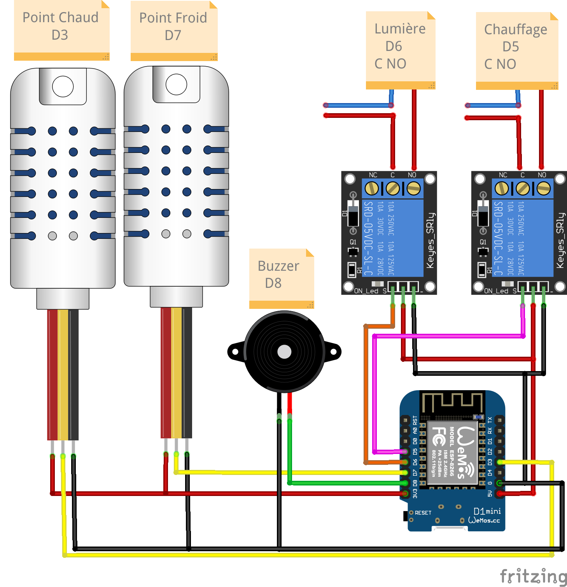
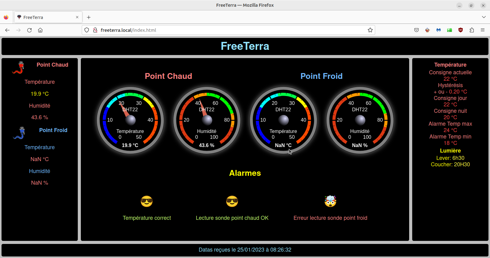

# FreeTerra

## Terrarium connécté

Le programme du terrarium tourne sur une puce **esp8266**, donc soit sur un **NodeMCU**, soit une **Wemos D1** ou autre **board à base d'ESP12.**  

Il est **couplé à une application mobile**, qui sert à configurer les differents paramètres du terrarium et à consulter les datas du terrarium.  

Le terrarium génère **un site web** qui sert également à la consultation des datas du terrarium.  

## Le matériel nécessaire

- Un smartphone                                     
- Un NodeMCU ou une Wemos D1                        
- Un relais pour la lumière                         
- Une sonde DHT22 ou 21 pour le point chaud         
- Un relais pour le chauffage                       
- Un buzzer pour les alarmes                        
- Une sonde DHT22 ou 21 pour le point froid       

## Le montage

## Fonctionnement

Au premier démarrage, le programme attend de recevoir sa configuration par le smartphone :

 

il sonne en attendant de la recevoir.    

Une fois que l'on a envoyer les paramètres de températures , de l'éclairage etc.. le programme régule la température et gère l'éclairage.

Il génère un site web qui sert a visualiser les datas du terrarium :

Elles sont également visible sur l'application :

Le terrarium sonne quand il y a un problème et le défaut s'affiche sur le site web ou l'application.