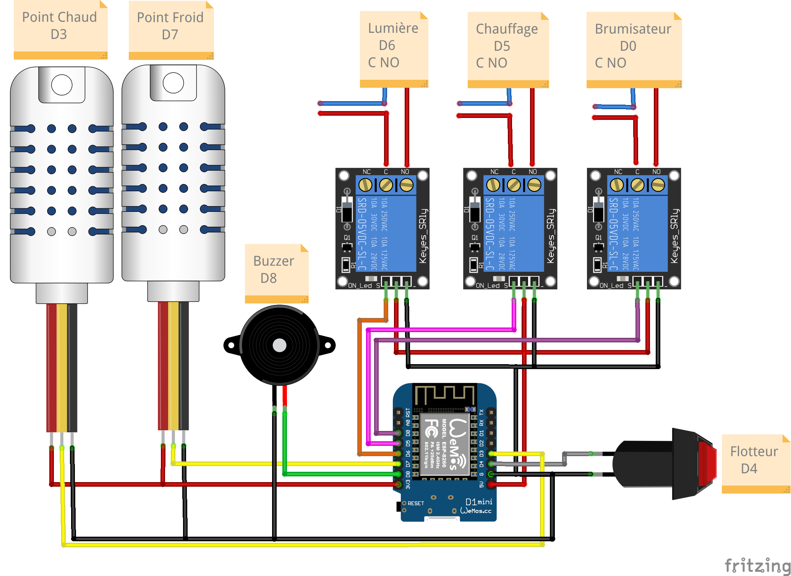
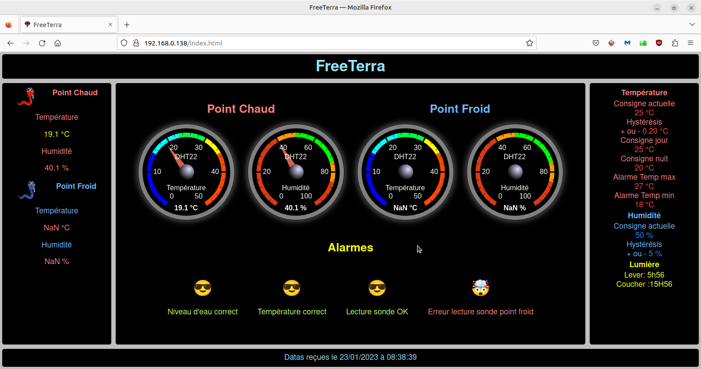
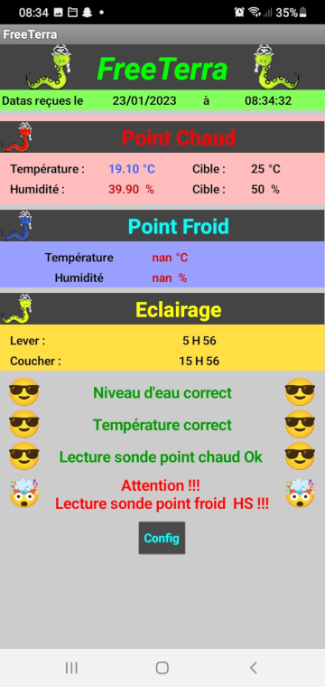
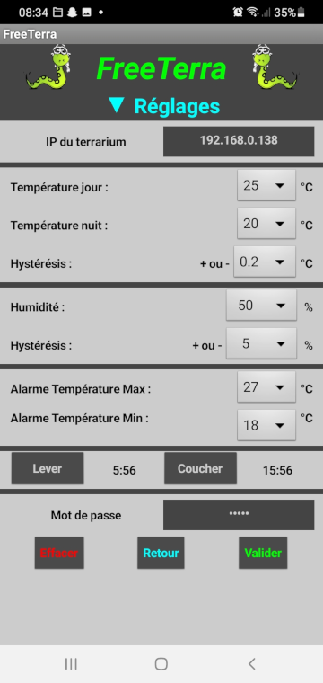

# FreeTerra

## Terrarium connécté

Le programme du terrarium tourne sur une puce **esp8266**, donc soit sur un **NodeMCU**, soit une **Wemos D1** ou autre **board à base d'ESP12.**  

Il est **couplé à une application mobile**, qui sert à configurer les differents paramètres du terrarium et à consulter les datas du terrarium.  

Le terrarium génère **un site web** qui sert également à la consultation des datas du terrarium.  

## Le matériel nécessaire

- Un smartphone                                     
- Un NodeMCU ou une Wemos D1                        
- Un relais pour la lumière                         
- Une sonde DHT22 ou 21 pour le point chaud         
- Un relais pour le chauffage                       
- Un buzzer pour les alarmes                        
- Une sonde DHT22 ou 21 pour le point froid         
- Un relais pour le brumisateur                     
- Un flotteur(switch) pour le niveau d'eau          

## Le montage

## Les librairies nécéssaires

- https://github.com/gmag11/NtpClient  
- https://github.com/me-no-dev/ESPAsyncUDP 
- https://github.com/PaulStoffregen/Time
- https://github.com/adafruit/Adafruit_Sensor
- https://github.com/adafruit/DHT-sensor-library
- https://github.com/weedmanu/RegulTerra

## Fonctionnement

Au premier démarrage, le programme attend de recevoir sa configuration par le smartphone, il sonne en attendant de la recevoir.    

Une fois que l'on a envoyer les paramètres de températures , de l'éclairage etc.. le programme régule la température et gère l'éclairage.

Il génère un site web qui sert a visualiser les datas du terrarium :

 elles sont également visible sur l'application :

## l'application pour smartphone

Pour installer l'application il faut prendre le fichier **FreeTerra.apk**

Si vous voulez voir comment est faite l'application, ou la tester avant de l'installer il faut se rendre sur ce site :    

[http://ai2.appinventor.mit.edu](http://ai2.appinventor.mit.edu)

Il faut créer un compte puis importer le ficher **FreeTerra.aia**

Ensuite il vous faut l'application [aicompanion](https://play.google.com/store/apps/details?id=edu.mit.appinventor.aicompanion3&hl=fr&gl=US&pli=1) sur votre smartphone.

sur le site dans **l'onglet conecte** lancez **compagnon AI**, un QR code apparait.
avec l'application **aicompanion** scannez le QR code, l'application est maintenant simuler sur votre smartphone

si vous voulez l'installer depuis le site, allez dans l'onget construire, puis scannez le QR code. 