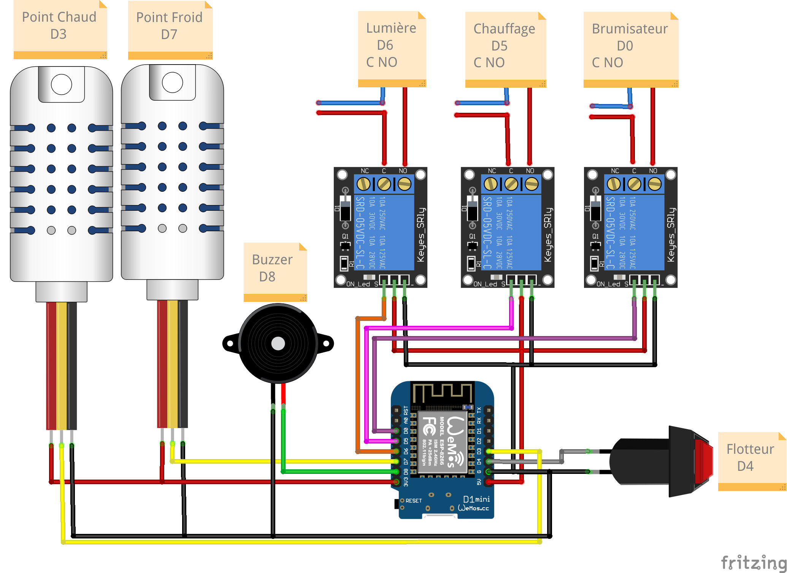

# FreeTerra

## Terrarium connécté

Le programme du terrarium tourne sur une puce **esp8266**, donc soit sur un **NodeMCU**, soit une **Wemos D1** ou autre **board à base d'ESP12.**  

Il est **couplé à une application mobile**, qui sert à configurer les differents paramètres du terrarium et à consulter les datas du terrarium.  

Le terrarium génère **un site web** qui sert également à la consultation des datas du terrarium.  

## Le matériel nécessaire

- Un smartphone                                     (Obligatoire)
- Un NodeMCU ou une Wemos D1                        (Obligatoire)
- Un relais pour la lumière                         (Obligatoire)
- Une sonde DHT22 ou 21 pour le point chaud         (Obligatoire)
- Un relais pour le chauffage                       (Obligatoire)
- Un buzzer pour les alarmes                        (Obligatoire)
- Une sonde DHT22 ou 21 pour le point froid         (Obligatoire)
- Un relais pour le brumisateur                     (Obligatoire)
- Un flotteur(switch) pour le niveau d'eau          (Obligatoire)

## Le montage

## Les librairies nécéssaires

- https://github.com/gmag11/NtpClient  
- https://github.com/me-no-dev/ESPAsyncUDP 
- https://github.com/PaulStoffregen/Time
- https://github.com/adafruit/Adafruit_Sensor
- https://github.com/adafruit/DHT-sensor-library

## Fonctionnement