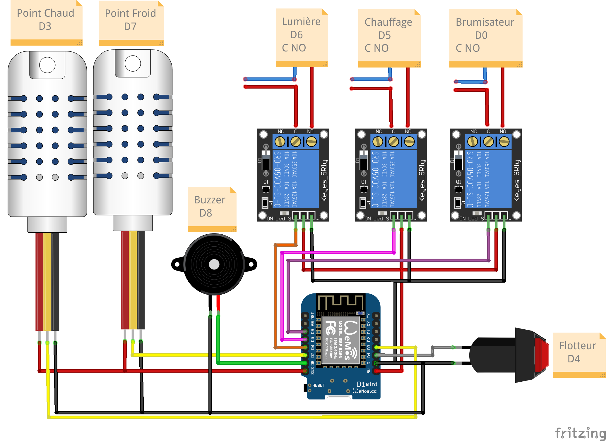

# FreeTerra

## Terrarium connécté

Le programme du terrarium tourne sur une puce **esp8266**, donc soit sur un **NodeMCU**, soit une **Wemos D1** ou autre **board à base d'ESP12.**  

Il est **couplé à une application mobile**, qui sert à configurer les differents paramètres du terrarium et de consulter les datas du terrarium.  

Le terrarium génère **un site web** qui sert également à la consultation des datas du terrarium.  

## Le matériel nécessaire

- Un NodeMCU ou une Wemos D1 (tout ce qui est équipé d'un ESP12)
- Une sonde DHT22 ou 21 pour le point chaud         (Obligatoire)
- Un relais pour le chauffage                       (Obligatoire)
- Une sonde DHT22 ou 21 pour le point froid         (Optionnel)
- Un relais pour la lumière                         (Obligatoire)
- Un relais pour le brumisateur                     (Optionnel)
- Un buzzer pour les alarmes                        (Optionnel mais recommandé)
- Un flotteur(switch) pour le niveau d'eau          (Optionnel)
- Un smartphone                                     (Obligatoire)

## Le montage

## Le fonctionnement

Au démarrage du programme, il vérifie si un fichier de config est présent.
S'il n'y en a pas, le terrarium sonnera, il attend de recevoir ses paramètres de fonctionnement.

Par l'application mobile FreeTerra, on lui envoie les paramètres, et les options présentes.

Ensuite le terrarium régulera sa température en fonction de la consigne, la lumière s'allumera et s'éteindra aux heures paramétrées.

- Si l'option PointFroid est activé, les datas de celle-ci seront affichées sinon elles ne seront pas présentes.  
- Si l'option SiteWeb est activé,  en plus de l'application, un site web affichant les datas du terrarium est accessible sur l’IP du terrarium ou par son nom mdms:  
**http://IP_du_terrarium** ou **http://freeterra.local**  
- Si l'option Brumisateur est activé, dans l'application vous pourrez choisir le mode de fonctionnement du brumisateur.    
En mode auto, le terrarium régulera l'humidité au point chaud en fonction de la consigne sinon, il ne fait rien, passer le en auto quand vous souhaiter remonter l'humidité puis rebasculer le en manuel.  
- Si l'option NiveauEau est activé,  vous disposé d'un switch flotteur, ou autre qui verifie le niveau d'eau.
- Si l'option Sonnerie est activé, quand une alarme survient (lecture sonde HS, niveau d'eau trop bas, temp max ou min atteint) le terrarium sonne en plus de l'afficher sur l'appli et ou le site web, en plus de cela vous pouvez faire jouer divers chansons au terrarium par l'application.
- Si l'option SMS est activé, si vous êtes chez Free mobile, quand une alarme survient (lecture sonde HS, niveau d'eau trop bas, temp max ou min atteint) vous recevrez un SMS. 

Quand une erreur survient, et que vous resolvez le problème, il faut effacer l'alarme par l'application, elle n'apparait plus a l'affichage.  
Concernant l'option Sonnerie et SMS si elle sont active :  
          Tant qu'on a pas aquitter l'alarme le terrarium sonne, par contre vous ne recevrez qu'un seul SMS, il ne vous en renverra que s'il n'y a pas d'alarmes en cours.  

